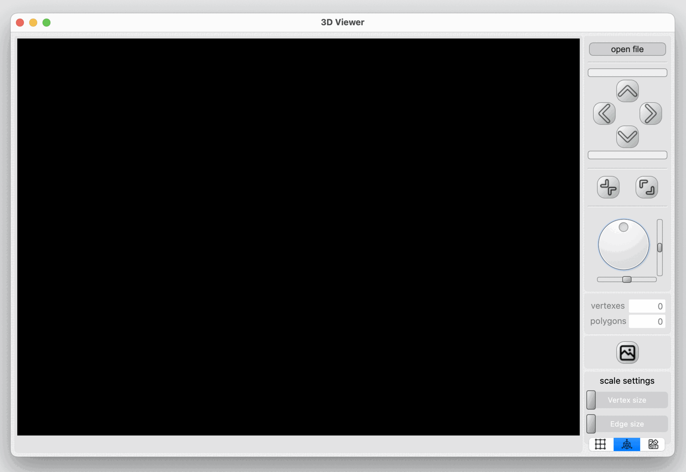

## 3D Viewer
School 21 programming school educational project. 

The 3D viewer program a robust platform for working  with 3D wireframe models. It offers essantial manipulation tools, a user-friendly interface, and additional customization options for an enriched user experience. 

You can also move, zoom out, zoom in and rotate the model. 
The program is optimized to handle models with varying complexities, from 100 to 1,000,000 vertices, ensuring smooth performance without interface freezing. 

 

In the lower right corner are the display settings. They are saved between sessions.

 
 

## Installation
To install, you will need Qt version 6, cmake, make, and a GCC compiler. 
Navigate to the `src` directory and run the `make install` command.

## For developers
The project is developed following the MVP pattern on the Qt framework, in C++17 language . 
The render window uses the openGL library. 
All code related to the Model block is documented. To view the doxygen documentation, navigate to the `src` directory and run the `make dvi` command. 
All code related to the Model block is covered on 100% with unit tests. Run command `make gcov_report` from `src`
directory, to view the coverage report. 

## Contributors
[__Albert Nikitin__](https://github.com/erosrolf) 
[__Chulpan Bahteeva__](https://github.com/SwCherr) 
[__Julia Kungurova__](https://github.com/chulpanbahteeva) 
